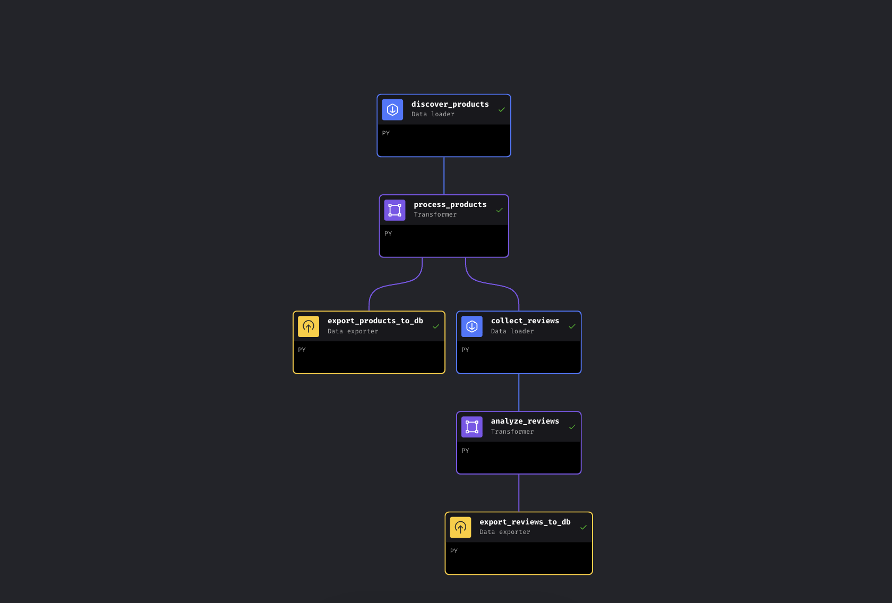
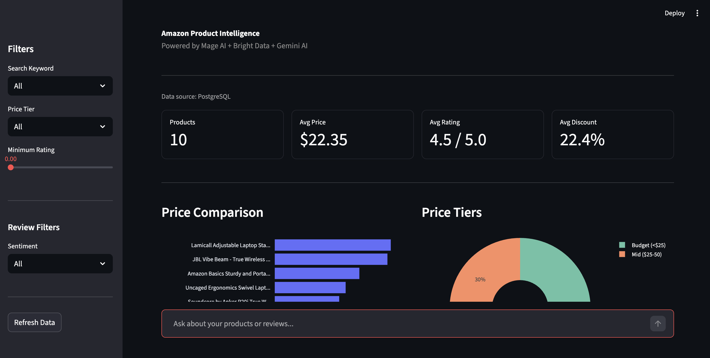

# Bright Data + Mage AI: Amazon Product Intelligence

A Python pipeline that chains **two Bright Data scrapers** with **Mage AI**, **Gemini**, and **PostgreSQL** to collect and analyze Amazon product data. Covers product discovery and AI-powered review analysis. Results show up on a **Streamlit dashboard**. Runs with Docker and a single API key.

**No proxy management, no CAPTCHA solving, no anti-bot headaches**. Bright Data's Web Scraping API handles all of that. You send keywords, you get clean structured JSON back. This project uses Mage AI, but the Bright Data API calls are standard HTTP requests that work the same way in Airflow, Prefect, Dagster, or a plain Python script.

**Use cases**: competitive price monitoring, product sentiment tracking, market research, bulk review analysis.

## Quick start

**Prerequisites**: Docker, a [Bright Data](https://brightdata.com) API token (free trial, no credit card required), and optionally a [Gemini API key](https://aistudio.google.com/apikey) (free tier works; without it, the pipeline falls back to rating-based sentiment).

```bash
git clone https://github.com/triposat/mage-brightdata-demo.git
cd mage-brightdata-demo
cp .env.example .env
# Add your BRIGHT_DATA_API_TOKEN (required) and GEMINI_API_KEY (optional) to .env
docker compose up -d
```

Open `http://localhost:6789`, run the pipeline (~5-8 minutes), then see results at `http://localhost:8501`.

## How it works

The pipeline has 6 blocks across two parallel branches:



| Block | Type | What it does |
|-------|------|--------------|
| `discover_products` | Data Loader | Discovers products by keyword via Bright Data Products API |
| `process_products` | Transformer | Enriches data with price tiers, discounts, rating categories |
| `export_products_to_db` | Data Exporter | Stores products in PostgreSQL and CSV backup |
| `collect_reviews` | Data Loader | Collects reviews for top products via Bright Data Reviews API |
| `analyze_reviews` | Transformer | Gemini AI sentiment analysis, issue and theme extraction |
| `export_reviews_to_db` | Data Exporter | Stores analyzed reviews in PostgreSQL and CSV backup |

After processing products, the pipeline **branches**: one branch exports products to PostgreSQL immediately, while the other collects reviews, runs AI analysis, and exports results. If review collection fails, product data is already safe.

## Sample output

```
10 products for "laptop stand" + "wireless earbuds"
├── Soundcore Anker P20i Earbuds     | $19.99 | 4.4★ | 95,089 reviews
├── JBL Vibe Beam Earbuds            | $34.95 | 4.3★ | 34,826 reviews
├── BESIGN LS03 Laptop Stand         | $14.24 | 4.8★ | 22,845 reviews
├── Lamicall Adjustable Laptop Stand | $35.99 | 4.7★ |  9,966 reviews
└── ... (6 more)

Sentiment (Gemini AI): 90% Positive, 10% Negative
Top Themes: sound quality (15), value for money (6), battery life (6), comfort (4)
```

Here's what the dashboard looks like:



## Pipeline variables

Configure in the Mage UI trigger or directly in `metadata.yaml`:

```yaml
variables:
  keywords:
    - laptop stand
    - wireless earbuds
  limit_per_keyword: 5
  top_n_products: 2
  reviews_per_product: 10
  sort_by: reviews_count
```

## Project structure

```
mage-brightdata-demo/
├── docker-compose.yml          # Mage AI + PostgreSQL + Dashboard
├── dashboard.py                # Streamlit dashboard
├── .env.example                # Environment variable template
├── requirements.txt            # Python dependencies
└── mage_project/
    ├── data_loaders/
    │   ├── amazon_product_discovery.py    # Bright Data Products API
    │   └── amazon_reviews_collector.py    # Bright Data Reviews API
    ├── transformers/
    │   ├── process_amazon_products.py     # Product enrichment
    │   └── analyze_reviews.py             # Gemini AI (3-model rotation)
    ├── data_exporters/
    │   ├── export_products_to_db.py       # Products → PostgreSQL + CSV
    │   └── export_reviews_to_db.py        # Reviews → PostgreSQL + CSV
    └── pipelines/
        └── amazon_product_intelligence/   # Pipeline config
```

## Bright Data scrapers used

| Scraper | Dataset ID | Purpose |
|-----|------------|---------|
| [Amazon Products](https://brightdata.com/products/web-scraper/amazon) | `gd_l7q7dkf244hwjntr0` | Discover products by keyword |
| [Amazon Reviews](https://brightdata.com/products/web-scraper/amazon) | `gd_le8e811kzy4ggddlq` | Collect reviews by product URL |

This demo uses Amazon, but Bright Data offers **ready-made scrapers for 100+ websites** including Walmart, eBay, Google Shopping, and more. Same API pattern, different dataset ID. To switch platforms, swap the `DATASET_ID` in the data loader blocks and adjust the input parameters to match the new scraper's schema. See the [blog post tutorial](https://brightdata.com/blog/how-tos/bright-data-mage-ai-amazon-pipeline-tutorial) for details.

## Resources

- [Blog Post Tutorial](https://brightdata.com/blog/how-tos/bright-data-mage-ai-amazon-pipeline-tutorial) – Step-by-step walkthrough
- [Bright Data Web Scraping API docs](https://brightdata.com/products/web-scraper) – API reference and dataset catalog
- [Bright Data free trial](https://brightdata.com) – Get your API token
- [Mage AI documentation](https://docs.mage.ai) – Pipeline orchestration framework

## More from Bright Data

- [Bright Data MCP](https://github.com/brightdata/brightdata-mcp)
- [Amazon Scraper](https://github.com/luminati-io/Amazon-scraper)
- [LinkedIn Scraper](https://github.com/luminati-io/LinkedIn-Scraper)
- [Twitter Scraper](https://github.com/luminati-io/twitter-scraper)
- [Crunchbase Scraper](https://github.com/luminati-io/crunchbase-scraper)
- [SERP API](https://github.com/luminati-io/serp-api)
- [Google Search API](https://github.com/luminati-io/google-search-api)
- [Google Reviews API](https://github.com/luminati-io/google-reviews-api)
- [Google Maps Scraper](https://github.com/luminati-io/Google-Maps-Scraper)
- [Google News Scraper](https://github.com/luminati-io/Google-News-Scraper)
- [Google Trends API](https://github.com/luminati-io/google-trends-api)
- [Google Hotels API](https://github.com/luminati-io/google-hotels-api)
- [Google Flights API](https://github.com/luminati-io/google-flights-api)
- [Yandex API](https://github.com/luminati-io/yandex-api)
- [DuckDuckGo API](https://github.com/luminati-io/duckduckgo-api)
- [Zillow Scraper](https://github.com/luminati-io/Zillow-Scraper)
- [MLS Scraper](https://github.com/brightdata/mls-scraper)
- [Web Unlocker API](https://github.com/luminati-io/web-unlocker-api)
- [TrendScan](https://github.com/brightdata/trendscan)
